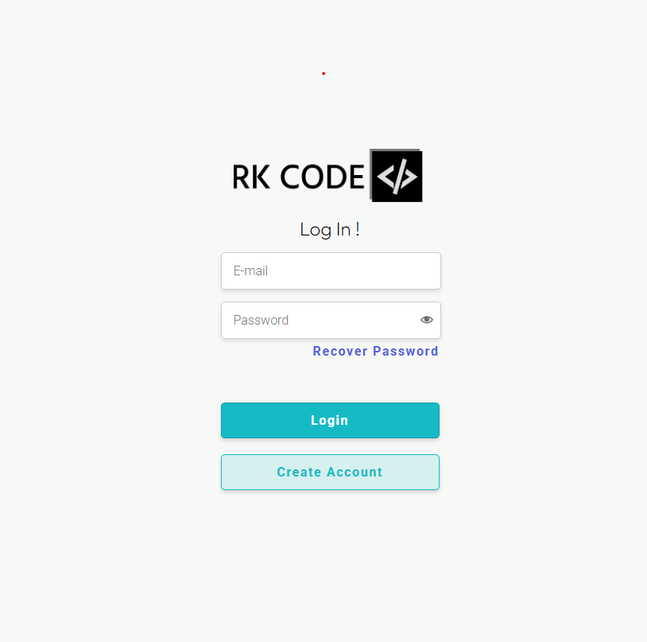

# Calculating start and end time of procedures

## Table of Content
* [General info](#General-info)
* [Technologies](#Technologies)
* [Setup](#Setup)

## General info
Simple website build with firebase with application app to enter medical procedures and start time of first one. The app calculates the start and end times of each treatment for billing purposes.
In the future, the aplication will be expanded by adding, removing and modifying the procedure database.

## Technologies
React.

## Setup
Download dependencies using:
```
$ npm -i
```

To run this project:
```
$ npm start
```

To login use:
```
login: test@test.pl
password: Silesia2022!
```
